# Hardware Connection Guide (Verified with Pinout)

This document outlines the wiring for the Waste Segregation Monitoring System. All connections refer to the **BCM Pins** on your Raspberry Pi.

### Visual Connection Diagram

```mermaid
graph TD
    subgraph "Raspberry Pi (Physical Header)"
        P11[GPIO 17 - Pin 11]
        P13[GPIO 27 - Pin 13]
        P15[GPIO 22 - Pin 15]
        P16[GPIO 23 - Pin 16]
        P18[GPIO 24 - Pin 18]
        P12[GPIO 18 - Pin 12]
        P29[GPIO 05 - Pin 29]
        P31[GPIO 06 - Pin 31]
        V5[5V Rail - Pin 2/4]
        V3[3.3V Rail - Pin 1/17]
        GND[Ground - Pin 6/9/14/20]
    end

    subgraph "Sensors & Actuators"
        IR[IR Sensor]
        MS[Moisture Sensor]
        MET[2-Pin Metal Sensor]
        ULT1[Ultrasonic WET]
        ULT2[Ultrasonic METAL/DRY]
        SRV[Servo Motor]
    end

    %% IR Sensor
    IR -- OUT --> P11
    IR -- VCC --> V5
    IR -- GND --> GND

    %% Moisture Sensor
    MS -- DO --> P13
    MS -- VCC --> V3
    MS -- GND --> GND

    %% 2-Pin Metal Sensor (Assuming Switch Mode)
    MET -- Pin 1 --> P15
    MET -- Pin 2 --> GND
    MET -- VCC --> V3

    %% Ultrasonic Sensor 1 (Wet)
    ULT1 -- TRIG --> P16
    ULT1 -- ECHO --> P18
    ULT1 -- VCC --> V5
    ULT1 -- GND --> GND

    %% Ultrasonic Sensor 2 (Metal/Dry)
    ULT2 -- TRIG --> P29
    ULT2 -- ECHO --> P31
    ULT2 -- VCC --> V5
    ULT2 -- GND --> GND

    %% Servo
    SRV -- PWM --> P12
    SRV -- VCC --> V5
    SRV -- GND --> GND
```

### Complete Pinout Table

| Component | Signal | BCM Pin | Physical Pin | Note |
| :--- | :--- | :--- | :--- | :--- |
| **IR Sensor** | OUT | **GPIO 17** | **11** | Detects Waste |
| **Moisture Sensor** | DO | **GPIO 27** | **13** | Wet/Dry Detection |
| **Metal Sensor** | Pin 1 | **GPIO 22** | **15** | Connect Pin 2 to GND |
| **Ultrasonic 1 (WET)** | TRIG | **GPIO 23** | **16** | Trigger for Wet Bin |
| **Ultrasonic 1 (WET)** | ECHO | **GPIO 24** | **18** | Level for Wet Bin |
| **Ultrasonic 2 (METAL/DRY)** | TRIG | **GPIO 05** | **29** | Trigger for Metal/Dry Bin |
| **Ultrasonic 2 (METAL/DRY)** | ECHO | **GPIO 06** | **31** | Level for Metal/Dry Bin |
| **Servo Motor** | PWM | **GPIO 18** | **12** | Flap Control |

### ⚠️ Special Instructions for your 2-Pin Metal Detector:
Since you have a **2-pin** detector with an inbuilt buzzer:
1.  Connect **one pin** of the sensor to **Physical Pin 15 (GPIO 22)**.
2.  Connect the **other pin** to any **Ground (GND) pin** (like Pin 9 or 14).
3.  The code uses an internal pull-up resistor. When the sensor detects metal and "closes", the voltage drops to 0V, signaling the Pi.

### ⚠️ Critical Protection for Ultrasonic Echo:
The **Echo pins (18 and 31)** send 5V back to the Pi, which can damage it. 
*   For **each** Echo pin, you **must** use a voltage divider:
*   Connect Echo to a **1kΩ resistor**.
*   Connect the other side of that resistor to the **Pi GPIO pin** AND to a **2kΩ resistor**.
*   Connect the other side of the **2kΩ resistor** to **Ground**.
*   *This safely drops the 5V signal to 3.3V.*
